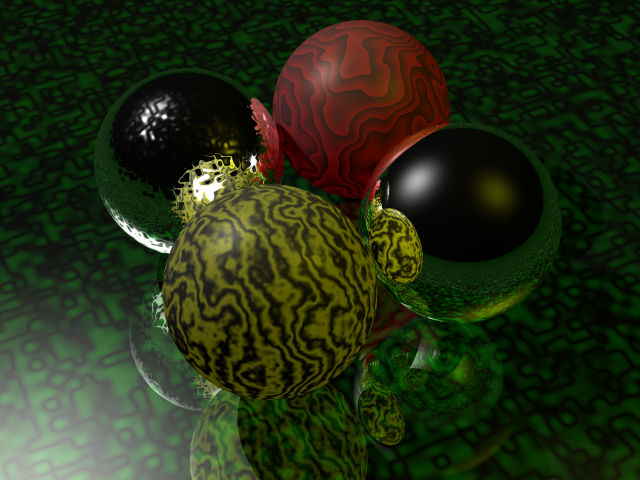

# raytracer - simple toy raytracer

Simple toy raytracer using C++11/14 features. Project is composed from
rendering library `render` written in C++11/14 and demo application
`rt_demo` demonstrating capabilities of `render` library.

## Description

Command line utility `rt_demo` reads description of scene to be rendered from
JSON file, and renders the scene to memory buffer. Buffer is then written to
output bitmap file.

```
./rt_demo <scene_file> <output_file>
```

### Known issues

  - Unlimited count of reflected rays.

## Example image



## Building raytracer

The C++11 tools library [`cclib`](https://github.com/izuzanak/cclib) is needed
for compilation of `rt_demo` program. It will be automatically compiled in
following compilation steps.

### Linux compilation

For compilation of a raytracer on Linux perform following steps:

  * Download script [`try_raytracer.sh`](https://raw.githubusercontent.com/izuzanak/raytracer/master/raytracer_try/try_raytracer.sh).

```
wget https://raw.githubusercontent.com/izuzanak/raytracer/master/raytracer_try/try_raytracer.sh
```

  * Check prerequisites mentioned in the script.
  * Execute script `try_raytracer.sh`.

```
bash try_raytracer.sh
```

It will clone two repositories `cclib` and `raytracer`, and then compile
`cclib` library, `render` library and raytracer demo `rt_demo`.

### Linux examples

There are few commands at the end of `try_raytracer.sh` script, that can be
executed after successful raytracer compilation.

Example of rendering scene described by file `scene.json` to file `scene.bmp`.

```
raytracer/build/rt_demo/rt_demo raytracer/tests/data/rt_demo/scene.json scene.bmp
```

